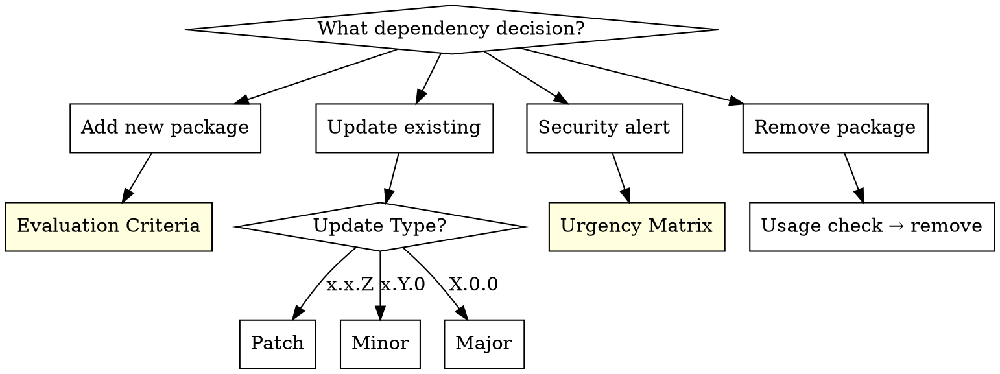

# Dependency Management Skill — Design

**Date:** 2026-02-27
**Type:** New skill (Technique/Pattern hybrid)
**Approach:** Decision tree focused, universal principles

## Summary

A decision-tree-centered skill that guides dependency management decisions: when to add, when to update, when to audit, and when to remove. Language/ecosystem agnostic — focuses on strategic principles rather than tool-specific commands.

## Frontmatter

```yaml
---
name: dependency-management
description: Use when adding new dependencies, deciding whether to update packages, running security audits on dependencies, evaluating library alternatives, or encountering outdated or vulnerable packages
---
```

## Triggering Conditions

- Adding a new package/library to a project
- `npm audit` / `pip-audit` / `cargo audit` security warnings
- Batch dependency update time
- Major version upgrade decisions
- Choosing between alternative libraries
- Lockfile merge conflicts
- Questioning if a package is still maintained

**Don't use when:**
- Internal module/code organization (that's refactoring)
- Learning a single package's API usage (that's research)

## Core Decision Tree



## New Package Evaluation Criteria

| Criterion | Question | Red Flag |
|-----------|----------|----------|
| **Necessity** | Can stdlib or existing deps do this? | Adding a package for 10 lines of code |
| **Maintenance** | Last commit? Issue/PR response time? | 12+ months inactive, unanswered issues |
| **Community** | Weekly downloads, stars, forks? | Very low usage, single maintainer |
| **License** | Compatible with project license? | GPL in commercial project (license contamination) |
| **Size** | Bundle size? Transitive dependency count? | Massive dep tree for a small task |
| **Security** | Known CVEs? Clean audit? | Active security vulnerabilities |
| **Alternatives** | Better/lighter alternative available? | Picking the first result without evaluating |

## Update Strategy

| Update Type | Strategy | Risk |
|-------------|----------|------|
| **Patch** (x.x.Z) | Update immediately, run test suite | Low |
| **Minor** (x.Y.0) | Read changelog, update, test | Medium |
| **Major** (X.0.0) | Breaking change analysis, migration plan, test on separate branch | High |

## Security Urgency Matrix

| Severity | Exploit exists? | Action | Timeframe |
|----------|----------------|--------|-----------|
| Critical | Yes | Update immediately or apply workaround | Hours |
| Critical | No | Priority update | 1-2 days |
| High | — | Update within sprint | 1 week |
| Medium/Low | — | Add to next update cycle | Planned |

## Common Mistakes

| Mistake | Reality |
|---------|---------|
| "Popular package is safe" | Popularity ≠ security. `event-stream` was hacked at 2M weekly downloads |
| "Lockfile commit is unnecessary" | Without lockfile, builds are not reproducible |
| "Update everything at once" | Batch updates make it impossible to isolate the source of issues |
| "Major update is just a version number" | Breaking change = potential refactoring |
| "Dev dependency security doesn't matter" | Supply chain attacks target build processes |
| "Add a package instead of writing 10 lines" | Every package adds attack surface and maintenance burden |

## Skill Structure

Target ~800-1000 words. Self-contained SKILL.md, no supporting files needed.

Sections:
1. Overview (core principle)
2. When to Use / When Not to Use
3. Decision Tree (Graphviz dot flowchart)
4. New Package Evaluation (quick reference table)
5. Update Strategy (table)
6. Security Urgency Matrix (table)
7. Lockfile & Pinning Rules (short list)
8. Common Mistakes (rationalization table)

## Integration Points

- **REQUIRED BACKGROUND:** None (standalone skill)
- **Related skills:**
  - `security-review` — A06 (Vulnerable and Outdated Components) overlaps; this skill goes deeper on decision-making
  - `systematic-debugging` — when a dependency update breaks something
  - `test-driven-development` — run tests after any dependency change
