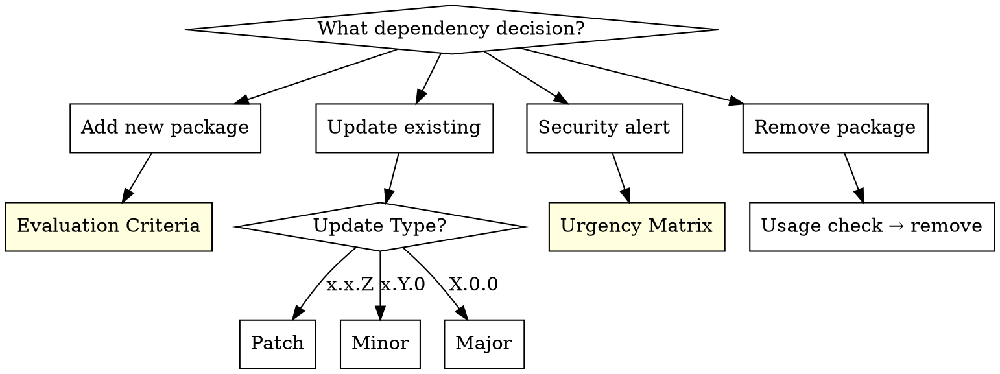

# Dependency Management

## Overview

Every dependency is a commitment -- to its maintenance, security surface, and upgrade path. Add deliberately, update strategically, audit regularly.

**Core principle:** Every dependency decision should be justified. Don't add what you can write. Don't ignore what you can update. Don't skip what you can audit.

## When to Use

- Adding a new package or library to a project
- Security audit warnings (npm audit, pip-audit, cargo audit, etc.)
- Batch dependency update time
- Major version upgrade decisions
- Choosing between alternative libraries
- Lockfile merge conflicts
- Questioning if a package is still maintained

**Don't use when:**
- Internal module/code organization (that's refactoring)
- Learning a single package's API (that's research)

## Decision Tree

## New Package Evaluation

Before adding any dependency, evaluate against all seven criteria:

| Criterion | Question | Red Flag |
|-----------|----------|----------|
| **Necessity** | Can stdlib or existing deps do this? | Adding a package for 10 lines of code |
| **Maintenance** | Last commit? Issue/PR response time? | 12+ months inactive, unanswered issues |
| **Community** | Weekly downloads, stars, forks? | Very low usage, single maintainer |
| **License** | Compatible with project license? | GPL in commercial project (license contamination) |
| **Size** | Bundle size? Transitive dependency count? | Massive dep tree for a small task |
| **Security** | Known CVEs? Clean audit? | Active security vulnerabilities |
| **Alternatives** | Better/lighter alternative available? | Picking the first result without evaluating |

**Rule of thumb:** If a package fails two or more criteria, find an alternative or write it yourself.

## Update Strategy

| Update Type | Strategy | Risk |
|-------------|----------|------|
| **Patch** (x.x.Z) | Update immediately, run test suite | Low |
| **Minor** (x.Y.0) | Read changelog, update, test | Medium |
| **Major** (X.0.0) | Breaking change analysis, migration plan, test on separate branch | High |

**Workflow for batch updates:**
1. Update patch versions first, run tests, commit
2. Update minor versions one by one, run tests after each
3. Tackle major versions individually on feature branches
4. Never batch major updates together -- isolate each one

## Security Urgency Matrix

| Severity | Exploit exists? | Action | Timeframe |
|----------|----------------|--------|-----------|
| Critical | Yes | Update immediately or apply workaround | Hours |
| Critical | No | Priority update | 1-2 days |
| High | -- | Update within sprint | 1 week |
| Medium/Low | -- | Add to next update cycle | Planned |

**When a security audit reports vulnerabilities:**
1. Run the audit tool for your ecosystem (npm audit, pip-audit, cargo audit, bundler-audit)
2. Classify each finding using the matrix above
3. Address critical/exploitable issues before any other work
4. Document accepted risks for findings you cannot immediately resolve

## Lockfile & Pinning Rules

- Always commit lockfiles (package-lock.json, yarn.lock, poetry.lock, Cargo.lock, etc.)
- Pin exact versions for production dependencies where possible
- Use ranges only for libraries (not applications)
- Never manually edit lockfiles -- use package manager commands
- After resolving lockfile merge conflicts, always run install to regenerate

## Common Mistakes

| Mistake | Reality |
|---------|---------|
| "Popular package is safe" | Popularity does not equal security. `event-stream` was hacked at 2M weekly downloads |
| "Lockfile commit is unnecessary" | Without lockfile, builds are not reproducible |
| "Update everything at once" | Batch updates make it impossible to isolate the source of issues |
| "Major update is just a version number" | Breaking change = potential refactoring |
| "Dev dependency security doesn't matter" | Supply chain attacks target build processes |
| "Add a package instead of writing 10 lines" | Every package adds attack surface and maintenance burden |

## Removing a Dependency

Before removing a package:
1. Search the codebase for all imports and usages
2. Check if other dependencies rely on it transitively
3. Remove the import statements and package reference, then run the full test suite
4. Verify the lockfile is cleanly regenerated after removal

## Related Skills

- **security-review** -- For auditing vulnerable and outdated components (OWASP A06)
- **systematic-debugging** -- For diagnosing issues introduced by dependency updates
- **verification-before-completion** -- For confirming dependency changes do not break the build
